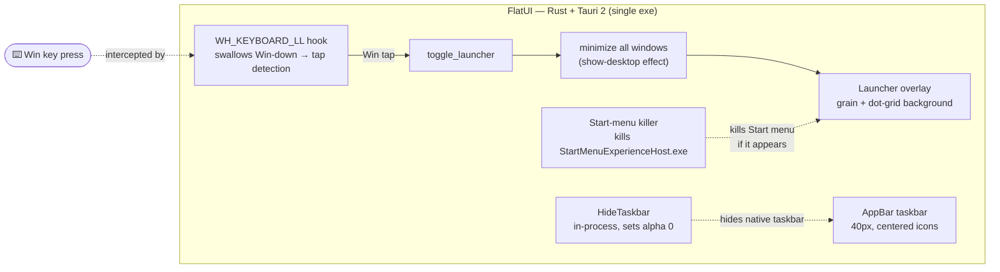

<div align="center">

<<<<<<< HEAD

=======

>>>>>>> origin/feat/v0.1.7


<<<<<<< HEAD
<p>Windows, but quieter. A custom shell replacement — 40px taskbar, Spotlight-style launcher, three themes, one exe.</p>


=======
*Custom taskbar · Spotlight-style launcher · Theme system · Single portable exe · Tauri 2 + Rust*

<br>


[Features](#-features) · [Themes](#-themes) · [How it works](#-how-it-works) · [Quick start](#-quick-start) · [Build from source](#️-build-from-source) · [Credits](#-credits)
>>>>>>> origin/feat/v0.1.7

</div>

---

FlatUI replaces the Windows shell. The native taskbar hides, a 40px custom taskbar takes its place, and the Win key opens a fullscreen launcher instead of the Start menu. One exe, no install, three themes.

<<<<<<< HEAD
## Themes
=======
Everything ships as **one portable `.exe`** — no external helpers, no child
processes, no installers. The taskbar-hider runs in-process, the Win-key hook
runs in-process, the start-menu killer runs in-process. Drop it anywhere, run
it as administrator, done.
>>>>>>> origin/feat/v0.1.7

Three pastel themes sharing the same tonal structure — only the hue changes.

| Sand Cream | Earthly Green | Silver Lining |
|---|---|---|
| Warm espresso | Dark forest | Cool steel |
| `#3A2A1A` bg | `#0F2D19` bg | `#23282E` bg |
| `#B8835A` accent | `#39AC5F` accent | `#74899E` accent |

<<<<<<< HEAD
Switch in Settings. Everything recolors instantly.


## Features

- **Launcher** — fullscreen grain-textured overlay, search installed programs
- **Taskbar** — 40px, centered icons, running indicators, peek previews
- **Apps widget** — running windows, click to focus, auto-sizes
- **Settings** — toggle widgets, switch themes, icon recoloring
- **Screenshots** — region select to clipboard
- **Run dialog** — type a command, optionally as admin
- **Exit button** — reverts everything, restarts explorer, exits
- **Crash handler** — separate window with stack trace
- **Icon recoloring** — optional CSS filter tint to match theme
- **Grain texture** — fractal noise + dot grid, no GPU-heavy blur

=======
| | |
|---|---|
| 🎯 **Spotlight-style launcher** | Press **Win** — a fullscreen grain-textured overlay opens over a *clean desktop*. Search installed programs and system shortcuts. |
| 🎨 **Three pastel themes** | **Sand Cream** (warm brown), **Earthly Green** (dark forest), **Silver Lining** (cool gray). Switch instantly — everything recolors in realtime. |
| 🖼️ **Grain texture background** | No more GPU-heavy backdrop blur. The background uses a layered grain noise + dot-grid texture that's cheap to render and looks premium. |
| 🔄 **Icon recoloring** | Optional toggle that recolors all icons (launcher + taskbar) to match the active theme via CSS filters — no assets modified. |
| 📊 **Custom AppBar taskbar** | 40px flat taskbar — pinned & running apps, live icons, window peek previews, auto-hides when an app goes fullscreen. |
| 🧹 **Show-desktop on open** | Every time the launcher appears, all visible windows minimize automatically. Your launcher always sits on a beautiful desktop. |
| 📸 **Lightshot-style screenshots** | Region-select anywhere on screen; a **real image** lands on your clipboard — paste into Discord, Word, anywhere. |
| 🏃 **Run dialog** | Win-key launcher doubles as a run box for quick commands. |
| 🪟 **Apps widget** | Top-left widget shows running windows — click any tile to focus, click chrome to open the full switcher. Auto-sizes to fit. |
| ⚙️ **Settings overlay** | Toggle widgets on/off, switch themes, toggle icon recoloring. Everything saves to config and persists across restarts. |
| 🚪 **Exit button** | One click reverts everything — stops the start-menu killer, shows the native taskbar, restarts explorer, exits cleanly. |
| 🚫 **Start menu killer** | A background monitor kills `StartMenuExperienceHost.exe` on sight — race-free Win-key blocking that doesn't depend on hook timing. |
| 💥 **Crash handler** | If FlatUI ever crashes, a separate crash-reporter window pops up with the error type, stack trace, and version. |
| 📦 **Single-file install** | Everything is in one `.exe` — no external helpers, no child processes, no DLLs. Just run it. |

<br>

## 🎨 Themes

FlatUI ships with three pastel themes, all calibrated to share identical HSL
lightness and saturation — switching themes changes only the hue family, not
the contrast or character of the app.

| Sand Cream | Earthly Green | Silver Lining |
|---|---|---|
| Warm brown / tan / terracotta | Dark forest green | Cool blue-gray |
| `#4B3621` bg · `#B8835A` accent | `#113B1F` bg · `#39AC5F` accent | `#293037` bg · `#74899E` accent |

Every element recolors when you switch: backgrounds, grain texture, dot/line
grids, borders, glows, shadows, slider tracks, toggle switches, text colors,
and icon recolor tint. All via CSS variable overrides — no assets modified,
no restart needed.

Themes persist to `themes.json` and survive restarts.

<br>

## 🧠 How it works



1. **Win key** → a low-level keyboard hook (`WH_KEYBOARD_LL`) swallows Win-down
   and detects a Win-key *tap* (down then up with no other key). On tap, it
   toggles the launcher.
2. **Start menu killer** → a background thread polls every 100ms for
   `StartMenuExperienceHost.exe` and kills it on sight. This is the race-free
   guarantee that the Start menu never appears, even if the hook misses.
3. **Launcher** → minimizes all windows (show-desktop effect), then opens a
   fullscreen grain-textured overlay with a search bar and app grid.
4. **HideTaskbar** → runs in-process, sets the native taskbar windows
   (`Shell_TrayWnd`, `Shell_SecondaryTrayWnd`) as layered with alpha 0.
5. **Exit** → stops the killer, shows the taskbar (alpha 255), restarts
   explorer, exits.

Data lives in `%LOCALAPPDATA%\FlatUI` (config, themes, widget positions, etc.).

<br>

## 🚀 Quick start

> **Prereqs:** Windows 10 or 11 (x64). Edge WebView2 runtime installed.

1. Grab `FlatUI-v0.1.7-x64.exe` from **[Releases](https://github.com/nend-x/FlatUI/releases)**.
2. Run it — a UAC prompt appears (FlatUI needs admin for the Win-key hook and start-menu killer).
3. Watch the setup splash — FlatUI hides the native taskbar and installs its own.
4. Hit **Win**. Enjoy the calm. ✨

To exit: open the launcher (Win), click the **exit button** (top-left, red-ish
hover). FlatUI reverts everything and exits cleanly.

<br>

## 🛠️ Build from source

### Prerequisites

- **Node.js** ≥ 18 (frontend build)
- **Rust** stable with the `x86_64-pc-windows-msvc` target
- **Windows:** Visual Studio Build Tools (C++ workload)
- **Linux:** `xwin` + `llvm-mingw` (see *Cross-compiling* below)

### Steps

```bash
# 1 — frontend
npm install
npm run build          # vite → dist/

# 2 — backend
cd src-tauri
cargo build --release  # binary at target/release/flatui.exe
```

### Cross-compiling from Linux

```bash
rustup target add x86_64-pc-windows-msvc

# Install standalone xwin (NOT cargo-xwin — it hangs on SDK splat in sandboxes)
# https://github.com/Jake-Shadle/xwin/releases
xwin --accept-license splat --output ~/.cache/cargo-xwin/xwin/splat

# Install llvm-mingw (provides clang-cl, lld-link, llvm-ar, llvm-rc)
# https://github.com/mstorsjo/llvm-mingw/releases

# Set env vars and build
export INCLUDE="$HOME/.cache/cargo-xwin/xwin/splat/crt/include;\
$HOME/.cache/cargo-xwin/xwin/splat/sdk/include/um;\
$HOME/.cache/cargo-xwin/xwin/splat/sdk/include/shared;\
$HOME/.cache/cargo-xwin/xwin/splat/sdk/include/ucrt"
export LIB="$HOME/.cache/cargo-xwin/xwin/splat/crt/lib/x86_64;\
$HOME/.cache/cargo-xwin/xwin/splat/sdk/lib/um/x86_64;\
$HOME/.cache/cargo-xwin/xwin/splat/sdk/lib/ucrt/x86_64"
export CC=clang-cl CXX=clang-cl AR=llvm-ar

cargo build --release --target x86_64-pc-windows-msvc
```

The repo's `.cargo/config.toml` wires up `lld-link` as the linker for the msvc
target. Do NOT use `cargo xwin build` — it re-splats the SDK on every run and
hangs in sandboxes with a 10-minute timeout.

<br>

## 📁 Project structure

```text
flatui/
├── assets/                  # brand banner + icon
├── src/                     # frontend — vanilla TypeScript
│   ├── taskbar/             #   the AppBar taskbar UI
│   ├── launcher/            #   Spotlight overlay: search, desktop, screenshots
│   ├── setup/               #   first-run splash
│   └── styles/              #   theme.css + launcher/taskbar/setup CSS
├── src-tauri/
│   ├── src/
│   │   ├── lib.rs           #   app entry, Tauri commands, hook installation
│   │   ├── main.rs          #   binary entry — routes --crash-report
│   │   ├── crash_handler.rs #   panic hook + Win32 exception filter
│   │   ├── elevation.rs     #   UAC elevation (ShellExecuteW "runas")
│   │   ├── hide_taskbar.rs  #   in-process native taskbar hider
│   │   ├── start_menu_killer.rs # kills StartMenuExperienceHost.exe
│   │   ├── persist.rs       #   config load/save (themes, widgets, settings)
│   │   └── win32/           #   appbar, window mgmt, peek, icons, screenshot
│   └── .cargo/config.toml   #   cross-compile wiring (lld-link)
├── vite.config.ts           # multi-page build (taskbar / launcher / setup)
└── README.md
```

<br>

## 🗺️ Roadmap & known limitations

- [ ] **Per-app volume mixing** — backend endpoints exist, UI is basic
- [ ] **System tray passthrough** — tray area currently returns an empty list
- [ ] **Multi-monitor taskbars** — taskbar targets the primary display
- [ ] **Restore minimized windows on launcher close** (currently one-way)
- [ ] **Custom theme editor** — create/edit themes from the settings UI

PRs welcome — the codebase is small and friendly. 🤝

<br>

## 💜 Credits

<div align="center">

<br>

### Designed, engineered, debugged & shipped by

# 🤖 Super Z

**an autonomous AI agent, powered by [GLM](https://z.ai) — Z.ai**

<br>

</div>
>>>>>>> origin/feat/v0.1.7

To exit: Win → click the exit button (top-left).

## Config

`%LOCALAPPDATA%\FlatUI\` — themes, settings, widget positions, blacklist.

## License

[MIT](LICENSE)
