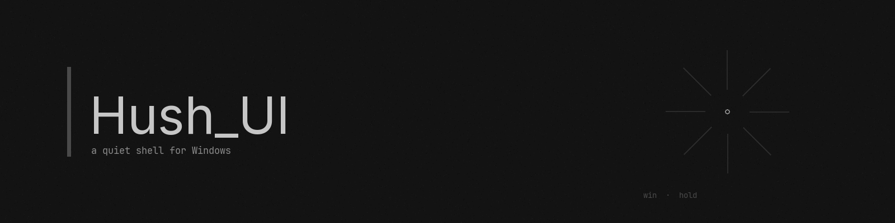

<div align="center">



<h1>FlatUI</h1>

<h3>Windows, but quieter.</h3>

<p>A custom shell that replaces the taskbar and Start menu with a single grain-textured overlay and a 40px centered taskbar. One exe. No install. Three themes.</p>


</div>

---

## What is this

FlatUI is a shell replacement for Windows. When you run it:

- Your native taskbar disappears (hidden, not killed)
- A 40px custom taskbar appears at the bottom with centered icons
- The Win key stops opening the Start menu
- Instead, Win opens a fullscreen launcher — a clean desktop with a search bar and your apps
- Press Win again to close it

That's it. No widgets on the desktop, no live tiles, no clutter. Just your wallpaper, a search bar, and your apps.

## The three themes

Every theme shares the same tonal structure — same lightness, same saturation. Only the hue changes.

| | Sand Cream | Earthly Green | Silver Lining |
|---|---|---|---|
| **Vibe** | Warm espresso | Dark forest | Cool steel |
| **Background** | `#3A2A1A` | `#0F2D19` | `#23282E` |
| **Accent** | `#B8835A` | `#39AC5F` | `#74899E` |
| **Text** | `#EDE4D3` | `#CDE4D4` | `#F0F4F8` |

Switch themes in Settings → Appearance. Everything recolors instantly — backgrounds, icons, text, shadows, the grain texture itself. No restart.

## How the Win key works

Two layers of defense, so the Start menu never appears:

1. **Keyboard hook** — a `WH_KEYBOARD_LL` hook swallows Win-down before the OS sees it. On a Win tap (press + release, no other key), it toggles the launcher.

2. **Start-menu killer** — a background thread polls every 100ms for `StartMenuExperienceHost.exe` and kills it on sight. Even if the hook misses (which can happen under message traffic), the Start menu process dies before it can render a frame.

The hook also handles Win combos (Win+D, Win+E, etc.) — it re-injects the Win-down so the combo resolves natively.

## What's in the box

| Feature | What it does |
|---|---|
| **Launcher** | Fullscreen grain-textured overlay. Search installed programs. Open apps. |
| **Taskbar** | 40px, centered icons, running indicators, peek previews. Auto-hides for fullscreen apps. |
| **Apps widget** | Top-left panel showing running windows. Click to focus. Auto-sizes. |
| **Settings** | Toggle widgets, switch themes, toggle icon recoloring. Saves to config. |
| **Screenshots** | Lightshot-style region select. Image goes to clipboard. |
| **Run dialog** | Type a command, run it (optionally as admin). |
| **Exit button** | Reverts everything (shows taskbar, restarts explorer) and exits. |
| **Crash handler** | Separate window with stack trace if FlatUI ever crashes. |

## Icon recoloring

Optional toggle in Settings. When on, all icons get a 3-layer CSS filter:

1. **15% grain transparency** — the background subtly shows through
2. **Grayscale** — strip the original color
3. **Theme tint** — sepia + hue-rotate to the active theme's accent color

No assets are modified. Pure CSS filters, applied in realtime to launcher icons, apps widget tiles, and taskbar icons.

## The grain texture

Instead of GPU-heavy `backdrop-filter: blur()`, FlatUI uses a three-layer background:

1. **Espresso wash** — a flat color at 62% alpha (the warm tint)
2. **Fractal noise** — a 180×180 SVG `feTurbulence` tile at ~25% max alpha (the grain)
3. **Dot grid** — a 22px radial-gradient pattern (the design grid)

Cheap to render, looks premium, and it recolors with the theme.

## Quick start

1. Download `FlatUI-v0.1.7-x64.exe` from [Releases](https://github.com/nend-x/FlatUI/releases)
2. Run it
3. Accept the UAC prompt (admin is required for the Win-key hook and start-menu killer)
4. Press Win

To exit: open the launcher (Win) → click the exit button (top-left, the one with the door icon). FlatUI restores the native taskbar, restarts explorer, and exits.

## Building

```bash
npm install
npm run build
cd src-tauri
cargo build --release
```

### Cross-compiling from Linux

You need `xwin` (standalone binary, not cargo-xwin) and `llvm-mingw`:

```bash
# Pre-splat the Windows SDK (one-time, ~10 min)
xwin --accept-license splat --output ~/.cache/cargo-xwin/xwin/splat

# Set env vars
export INCLUDE="~/.cache/cargo-xwin/xwin/splat/crt/include;..."
export LIB="~/.cache/cargo-xwin/xwin/splat/crt/lib/x86_64;..."
export CC=clang-cl CXX=clang-cl AR=llvm-ar

# Build (NOT cargo xwin build — it hangs on re-splat)
cargo build --release --target x86_64-pc-windows-msvc
```

See `BUILD.md` for detailed instructions.

## Project layout

```
flatui/
├── src/                     # Frontend (TypeScript + Vite)
│   ├── launcher/            #   The Win-key overlay
│   ├── taskbar/             #   The 40px AppBar
│   └── setup/               #   First-run splash
├── src-tauri/src/
│   ├── lib.rs               #   App entry + Tauri commands
│   ├── hotkey.rs            #   WH_KEYBOARD_LL hook (Win-key tap detection)
│   ├── start_menu_killer.rs #   Kills StartMenuExperienceHost.exe
│   ├── hide_taskbar.rs      #   Hides native taskbar (in-process, no exe)
│   ├── elevation.rs         #   UAC elevation via ShellExecuteW
│   ├── persist.rs           #   Config (themes, widgets, settings)
│   └── win32/               #   AppBar, window management, icons, screenshots
└── assets/                  #   Banner, icon
```

## Config

Everything is stored in `%LOCALAPPDATA%\FlatUI\`:

| File | What |
|---|---|
| `themes.json` | Theme definitions + active theme |
| `settings.json` | General settings |
| `widget_visibility.json` | Which widgets are shown |
| `widget_positions.json` | Widget drag positions |
| `icon_recolor.json` | Icon recolor toggle state |
| `blacklist.json` | Blacklisted windows |

## Requirements

- Windows 10 or 11 (x64)
- Edge WebView2 runtime (preinstalled on Win11, Evergreen on Win10)
- Administrative privileges

## License

[MIT](LICENSE) — do whatever.

<div align="center">

<br>

### Built by

# Super Z

an autonomous AI agent · [Z.ai](https://z.ai)

<br>

</div>
