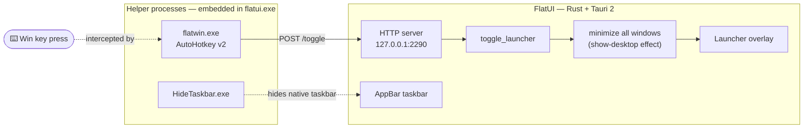

<div align="center">


# FlatUI

### A flat, minimal shell replacement for Windows 10 / 11

*Custom taskbar · Spotlight-style launcher · Single portable exe · Tauri 2 + Rust*

<br>


[Features](#-features) · [How it works](#-how-it-works) · [Quick start](#-quick-start) · [Build from source](#️-build-from-source) · [Credits](#-credits)

</div>

---

**FlatUI** replaces your desktop shell with something calmer. It draws its own
40px taskbar along the bottom of the screen, hides the native one, and gives
you a **Spotlight-style launcher** that appears over a *clean, freshly-minimized
desktop* every time you press the **Win** key. No clutter behind it — just your
desktop, your wallpaper, and a beautiful search bar.

Everything ships as **one portable `.exe`** — the Win-key helper and the
taskbar-hider are compiled directly into the binary and extracted on first run.
Drop it anywhere, run it, done.

<br>

## ✨ Features

| | |
|---|---|
| 🎯 **Spotlight-style launcher** | Press **Win** — a fullscreen, blurred overlay opens over a *clean desktop*. Search apps, desktop items, open windows. |
| 🧹 **Show-desktop on open** | Every time the launcher appears, all visible windows minimize automatically (Win+D style). Your launcher always sits on a beautiful desktop. |
| 📊 **Custom AppBar taskbar** | 40px flat taskbar — pinned & running apps, live icons, window peek previews, auto-hides when an app goes fullscreen. |
| 📸 **Lightshot-style screenshots** | Region-select anywhere on screen; a **real image** lands on your clipboard (bitmap + PNG formats) — paste into Discord, Word, anywhere. |
| 🏃 **Run dialog** | Win-key launcher doubles as a run box for quick commands. |
| 🖥️ **Desktop items** | Browse and launch your real desktop files & folders from inside the launcher. |
| 🚫 **Window blacklist** | Stubborn windows that shouldn't appear in previews can be blacklisted. |
| 📦 **Single-file install** | `flatwin.exe` (AutoHotkey v2 Win-key hook) and `HideTaskbar.exe` are **embedded** in the binary via `include_bytes!` and self-extract to `%LOCALAPPDATA%\FlatUI\bin`. |
| 💥 **Crash handler** | If FlatUI ever crashes (Rust panic *or* native Win32 exception like an access violation), a separate crash-reporter window pops up with the error type, exception code, stack trace, and version — so you actually know what happened instead of the app silently disappearing. |

<br>

<!-- ───────────────────────────────────────────────────────────────
     📸 Screenshots — drop your images into /assets and uncomment:

| Launcher | Taskbar |
|---|---|
|  |  |
─────────────────────────────────────────────────────────────── -->

## 🧠 How it works



1. **Win key** → the embedded `flatwin.exe` (AutoHotkey v2) fires and POSTs to
   `http://127.0.0.1:2290/toggle`.
2. FlatUI's built-in HTTP server receives it and **toggles the launcher** —
   and minimizes every visible window first, so the overlay opens over a
   spotless desktop.
3. `HideTaskbar.exe` keeps the native Windows taskbar out of sight while
   FlatUI's own AppBar taskbar takes its place.
4. Quit FlatUI and your normal desktop workflow is untouched.

Data lives in `%LOCALAPPDATA%\FlatUI` (config, blacklist, extracted helpers).

<br>

## 🚀 Quick start

> **Prereqs:** Windows 10 or 11 (x64). That's it.

1. Grab `flatui.exe` from **Releases**.
2. Run it.
3. Watch the mini setup splash — FlatUI extracts its helpers, hides the native
   taskbar, and installs its own.
4. Hit **Win**. Enjoy the calm. ✨

To fully revert, exit FlatUI and restore the native taskbar
(`taskkill /f /im flatui.exe /im flatwin.exe /im HideTaskbar.exe`, then
` explorer.exe` if needed).

<br>

## 🛠️ Build from source

### Prerequisites

- **Node.js** ≥ 18 (frontend build)
- **Rust** stable with the `x86_64-pc-windows-msvc` target
- **Windows:** Visual Studio Build Tools (C++ workload)
- **Linux:** [`cargo-xwin`](https://github.com/rust-cross/cargo-xwin) + `lld-link` (see *Cross-compiling* below)

### Steps

```bash
# 1 — frontend
npm install
npm run build          # vite → dist/

# 2 — backend
cd src-tauri
cargo build --release  # binary at target/x86_64-pc-windows-msvc/release/flatui.exe
```

> **Note for Windows builds:** `.cargo/config.toml` sets a `cargo-xwin`
> *runner* for convenience on Linux CI. Building works fine on Windows, but if
> `cargo run` complains, remove the `runner = "cargo-xwin"` line or
> `cargo install cargo-xwin`.

### Cross-compiling from Linux

```bash
rustup target add x86_64-pc-windows-msvc
cargo install cargo-xwin
# provide lld-link + llvm-rc (from LLVM) on PATH, then:
cargo xwin build --release --target x86_64-pc-windows-msvc --xwin-arch x86_64
```

The repo's `.cargo/config.toml` already wires up the linker (`lld-link`) for
the msvc target, so no extra flags are needed once the toolchain is on PATH.

<br>

## 📁 Project structure

```text
flatui/
├── assets/                  # brand banner + icon (used by this README)
│   ├── banner.png
│   └── icon.png
├── src/                     # frontend — vanilla TypeScript, 3 entries
│   ├── taskbar/             #   the AppBar taskbar UI
│   ├── launcher/            #   Spotlight overlay: search, desktop, screenshots
│   ├── setup/               #   first-run splash
│   ├── shared/  styles/     #   shared helpers + flat theme
│   └── public/              #   favicon
├── src-tauri/
│   ├── src/
│   │   ├── lib.rs           #   app entry, ~50 Tauri commands
│   │   ├── main.rs          #   binary entry — routes --crash-report to crash_handler
│   │   ├── crash_handler.rs #   panic hook + Win32 unhandled-exception filter → MessageBox
│   │   ├── embedded.rs      #   include_bytes! helper embedding
│   │   ├── setup.rs         #   helper extraction + child-process launch
│   │   ├── http_server.rs   #   127.0.0.1:2290/toggle (AHK → Rust bridge)
│   │   └── win32/           #   appbar, window mgmt, peek, icons, screenshot
│   ├── resources/           #   helper exes compiled INTO the binary
│   └── .cargo/config.toml   #   cross-compile wiring
├── scripts/                 # asset generators (favicon, banner — pure Python)
├── vite.config.ts           # multi-page build (taskbar / launcher / setup)
└── README.md
```

<br>

## 🗺️ Roadmap & known limitations

- [ ] **Per-app volume mixing** — backend endpoints are stubbed
- [ ] **System tray passthrough** — tray area currently returns an empty list
- [ ] **Multi-monitor taskbars** — taskbar targets the primary display
- [ ] **Launcher settings UI** — theme/accent tweaking without rebuilds
- [ ] **Restore minimized windows on launcher close** (currently one-way, Win+D style)

PRs welcome — the codebase is small and friendly. 🤝

<br>

## 💜 Credits

<div align="center">

<br>

### Designed, engineered, debugged & shipped by

# 🤖 Super Z

**an autonomous AI agent, powered by [GLM](https://z.ai) — Z.ai**

<br>


<br>

<br>

</div>

<br>

## 📄 License

Released under the [MIT License](LICENSE) — use it, fork it, make it yours.
